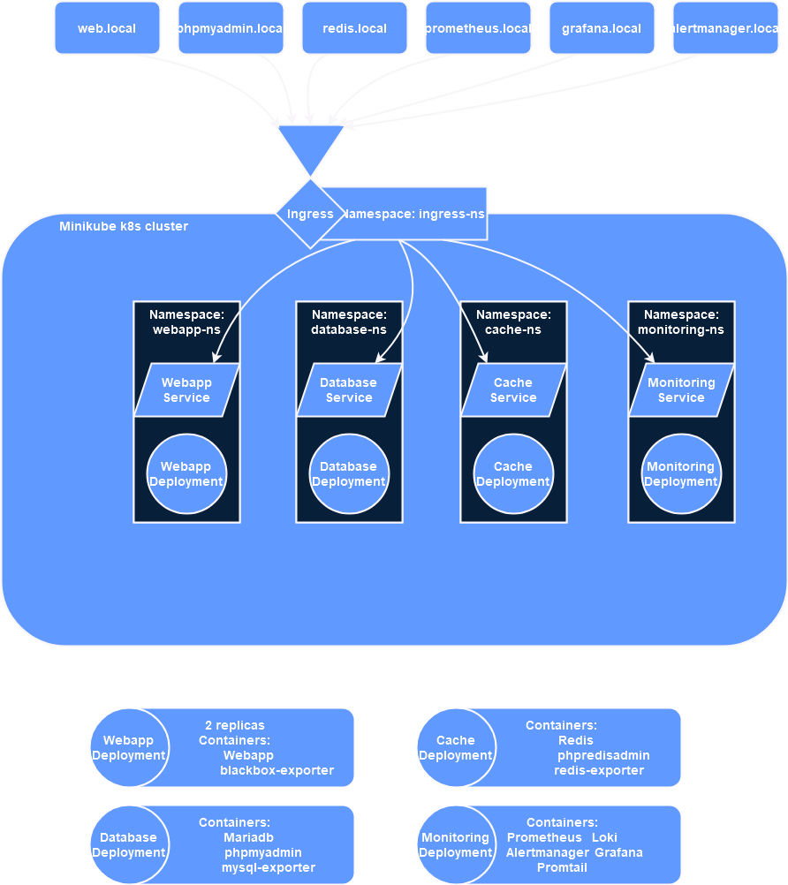

# Despliegue en Kubernetes
Este repositorio consiste en una prueba de despliege de diferentes servicios conectados entre sí basándose en el repositorio de `Infraestructura-como-codigo`, a un cluster de Kubernetes.<br>
Los diferentes servicios son una aplicación web, una base de datos, una caché, un load balancer (ingress) y un servicio de monitorización con Prometheus, Grafana, Alertmanager y Loki.<br>
Contienes las siguientes configuraciones de alta disponibilidad:
* La web tiene 2 pods.
* La caché está configurada con alta disponibilidad con 2 esclavos.
* El ReplicaSet de k8s se encarga de reiniciar los pods o levantar pods nuevos en caso de fallo o eliminación.

Además, se ha agregado un pipeline de CI/CD mediante GitHub Actions, aunque por no poder acceder al cloud no se aplican los cambios, hay que hacerlo manualmente. En la fase de `Deploy` de GitHub Actions, se describen los pasos para desplegar la nueva versión.<br>
Para desplegar la neva versión, a parte de poder desplegarla directamente, se pueden usar los scripts de simulación de despliege: `bluegreen-deploy.sh` y `canary-deploy.sh`. Los cuales muestran por pantalla las acciones que se van realizando.



## Despliegue de entornos
1. Iniciar el cluster de k8s usando el comando `minikube start`.
2. Habilitar la exposición de ingress de minikube hacia localhost.
   - `minikube addons enable ingress`
3. Modificar el archivo `/etc/hosts` añadiendo la siguiente configuración:
   - En Linux usar la ip del cluster `minikube ip` en vez de localhost.
   - ```
     127.0.0.1 web.local
     127.0.0.1 phpmyadmin.local
     127.0.0.1 redis.local
     127.0.0.1 prometheus.local
     127.0.0.1 grafana.local
     127.0.0.1 alertmanager.local
     ```
4. Ejecutar el script `preconfiguration.sh` o seguir los siguientes pasos:
   1. Crear los namespaces.
           - `kubectl create -f ./k8s/namespaces.yaml`
   2. Añadir los configmaps de los archivos de configuración.
       - ```
           kubectl create configmap db-configmap --from-file=./conf-files/init.sql --from-file=./conf-files/monitoring/prometheus/mysql-exporter.my-cnf -n database-ns
           kubectl create configmap prometheus-configmap --from-file=./conf-files/monitoring/prometheus/prometheus-conf.yml --from-file=./conf-files/monitoring/prometheus/alert-rules.yml -n monitoring-ns
           kubectl create configmap promtail-configmap --from-file=./conf-files/monitoring/prometheus/promtail.yaml -n monitoring-ns
           kubectl create configmap grafana-configmap --from-file=./conf-files/monitoring/grafana/provisioning/dashboards/all-dashboards.yml --from-file=./conf-files/monitoring/grafana/provisioning/datasources/datasources.yaml --from-file=./conf-files/monitoring/grafana/dashboard.json -n monitoring-ns
           kubectl create configmap alertmanager-configmap --from-file=./conf-files/monitoring/prometheus/alertmanager-conf.yml -n monitoring-ns
           ```
   3. Añadir el certificado autofirmado a los secrets de k8s.
       - `kubectl create secret tls self-signed --key=./conf-files/certs/cert.crt.key --cert=./conf-files/certs/cert.crt -n ingress-ns`
   4. Añadir los secrets de usuarios y contraseñas.
       - ```
           kubectl create secret generic db-user --from-literal=username='user' --from-literal=password='pass' -n webapp-ns
           kubectl create secret generic grafana-pass --from-literal=grafana-pass='pass' -n monitoring-ns
         ```
   5. Crear el rol para la monitorización.
       - `kubectl create -f ./k8s/roles-monitoring.yaml`
   6. Hacer el build de la imagen de la aplicación web desde dentro de la carpeta `WebApp`.
       - `minikube image build -t webapp:1.5 .`
5. En una terminal ejecutar el comando `minikube tunnel`.
6. En otra terminal añadir la carpeta shared al cluster con el comando `minikube mount ./shared:/shared`
7. Para desplegar el sistema ejecutar el script `apply-all-k8s-objects.sh` o los siguientes comandos:
   - ```
     cd k8s
     kubectl apply -f ingress.yaml
     kubectl apply -f webapp
     kubectl apply -f database
     kubectl apply -f cache
     kubectl apply -f monitoring
     ```
## Acceso al sistema
Ahora se pueden acceder a las webs de los diferentes servicios mediante el ingress:
> Hay que aceptar el certificado ya que está autofirmado.
* Para acceder a la aplicación web hay que entrar en: https://web.local
* Para acceder al servicio para administrar la base de datos se debe entrar en la siguiente web en localhost: https://phpmyadmin.local
    > Con usuario `user` y contraseña `pass`.
* Administrar la caché: https://cache.local
* Prometheus: https://prometheus.local
* Grafana: https://grafana.local
    > Con usuario `admin` y contraseña `pass`.
* Alertmanager: https://alertmanager.local

## Test
Se ha incluido un archivo de test `availability-test.sh` que comprueba sobretodo que el apartado de alta disponibilidad y persistencia de datos funciona, apagando y encendiendo los diferentes servicios. Puedes seguir sus acciones mediante un dashboard de kubernetes como el que ofrece minikube `minikube dashboard`.<br>
El script está pensado de tal forma que cuando para un servicio espera a que se pulse una tecla para continuar, de esta forma da tiempo a ver los resultados en el dashboard o comprobar los cambios.